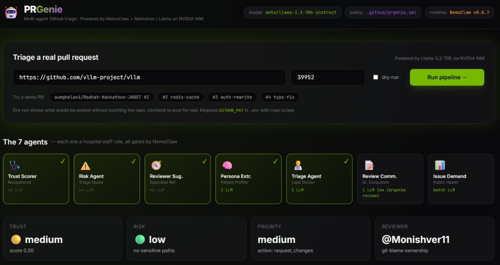
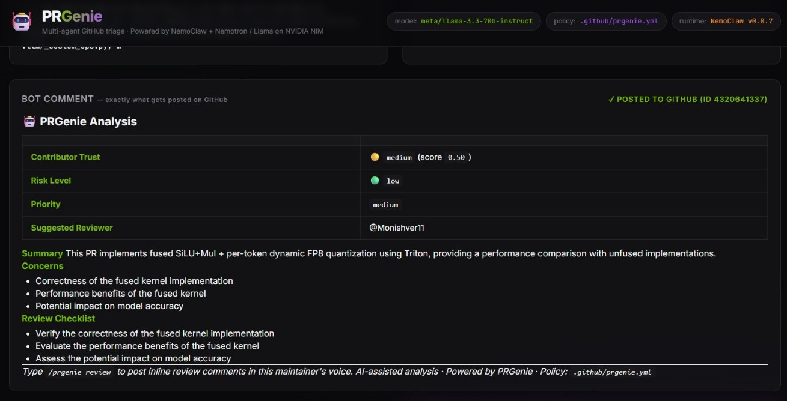

# PRGenie

> **A GitHub-native AI agent that triages PRs, scores contributor trust, and surfaces high-demand issues - entirely inside GitHub.**
> Powered by **NemoClaw** policy enforcement + **vLLM**-served Nemotron.





---

## What is PRGenie?

PRGenie is a **GitHub App**. You install it on a repo, and it starts watching pull requests and issues automatically - every PR gets triaged, every issue gets scored.

A team of **7 specialised agents** each plays a role:

| PRGenie Agent          | What it does in one line                                          |
|-----------------------|-------------------------------------------------------------------|
| Trust Scorer          | Looks at the contributor's history - friend or stranger?          |
| Risk Agent            | Scores PR risk from diff size + sensitive files touched           |
| Triage Agent          | Reads the diff, writes the summary, concerns, and checklist       |
| Reviewer Suggester    | Routes to the right reviewer via file ownership (git blame math)  |
| Persona Extractor     | Learns how this maintainer prefers to review                      |
| Review Commenter      | Posts inline comments in the maintainer's voice on `/prgenie review` |
| Issue Demand Agent    | Scores open issues by community engagement and maintainer silence |

All agents run under a single policy file - `.github/prgenie.yml` - enforced by **NemoClaw**. No agent can do anything the policy forbids.

---

## Quick start (mock mode, no GPU needed)

```bash
cd D:\projects\Hack\PR-Genie
python -m venv .venv
.venv\Scripts\activate          # Windows
# source .venv/bin/activate     # Linux/Mac
pip install -r requirements.txt
cp .env.example .env            # MOCK_MODE=true is the default
uvicorn backend.main:app --reload --port 8080
```

Then:
```bash
curl http://localhost:8080/health
# → {"status": "ok", "service": "prgenie"}
```

---

## Architecture at a glance

```
GitHub  ──webhook──►  FastAPI /webhook
                          │
                          ▼
                  webhook_handler.py  (HMAC verified)
                          │
        ┌─────────────────┼─────────────────┐
        ▼                 ▼                 ▼
   PR opened       /prgenie review      Issue opened
        │                 │                 │
        ▼                 ▼                 ▼
   ┌─Pipeline─┐    ReviewCommenter    IssueDemandAgent
   │ Trust    │    (1 LLM call)       (no LLM)
   │ Risk     │                              │
   │ Reviewer │                              ▼
   │ Triage   │ (1 LLM)              Label + comment
   └────┬─────┘                       (cluster every 15 min)
        ▼
  Check Run + bot comment + labels
        │
        ▼
       SQLite (cached)
```

Everything routes through the **NemoClaw policy enforcer** before any side-effect (label, comment, review).

---

## The 7 Agents

Each agent follows the same structure:
1. **Role** - what the agent does, one paragraph
2. **What it can access** - its inputs and read permissions
3. **What it's blocked from** - NemoClaw guardrails it cannot violate
4. **Policy snippet** - the `.github/prgenie.yml` keys that steer it
5. **How it talks to other agents** - its outputs and the shared state (DB + GitHub API)

---

### 1. Trust Scorer

**Role.**
First contact. When a PR lands, the Trust Scorer pulls up the contributor's record at this repo - past PRs, merge rate, how fast they answered review comments, account age - and assigns a trust band: `high`, `medium`, `new`, or `flagged`. **Zero LLM calls** - pure rules.

**What it can access.**
- `GET /repos/{owner}/{repo}/pulls?creator={login}&state=all` (last 20 PRs)
- `GET /users/{login}` (account age only)
- DB cache: `ContributorTrust` row (re-uses if updated within `cache_hours`)

**What it's blocked from.**
- `use_identity_signals` - name, org, nationality, profile photo. Behaviour-only.
- Cannot label a contributor `flagged` based on anything outside the repo's own history.

**Policy snippet** (`.github/prgenie.yml`):
```yaml
trust:
  auto_label: true
  high_threshold: 0.75
  cache_hours: 24
```

**How it talks to other agents.**
Writes `ContributorTrust { trust_level, trust_score, signals }` to the DB. The Risk Agent reads `trust_level` to amplify risk. The Triage Agent reads the full record to colour its summary.

---

### 2. Risk Agent

**Role.**
Counts how many sensitive files the diff touches (`auth/`, `crypto/`, `requirements.txt`, `.github/workflows/`…), looks at the diff size, mixes in the contributor's trust band, and assigns a risk level: `low / medium / high / critical`. **No LLM** - pattern matching on file paths.

**What it can access.**
- `pull_request.files` from the webhook payload
- `additions` / `deletions` counts
- `trust_level` from Trust Scorer (already in DB)
- `policy["risk"]["escalate_on"]` from the YAML

**What it's blocked from.**
- Cannot trigger an automatic close, merge, or reject - only labels and an escalation flag.
- Escalation only fires when **risk ≥ high AND trust ∈ {new, flagged}** - never just on diff size.

**Policy snippet:**
```yaml
risk:
  auto_label: true
  escalate_on:
    - auth/
    - crypto/
    - requirements.txt
    - .github/workflows/
```

**How it talks to other agents.**
Returns `{ risk_level, risk_score, sensitive_files, should_escalate }` in-process to the pipeline. The Triage Agent embeds this in its prompt; the GitHub client emits a `risk:*` label.

---

### 3. Triage Agent

**Role.**
The only agent that holds the full picture. Takes the diff, the maintainer's persona, the trust band, and the risk profile, and produces: a 2–3 sentence summary, a priority, a list of concerns, and a reviewer checklist. **One LLM call per PR** - the most expensive call in the system.

**What it can access.**
- Full PR diff (truncated to 3000 chars: head 1500 + tail 1500)
- Maintainer persona JSON
- Trust + Risk profiles
- Suggested reviewer login

**What it's blocked from.**
- Output is schema-validated **before** posting. Free-form text outside the JSON schema is dropped.
- Cannot recommend `merge` or `close` actions - only `approve / request_changes / comment / escalate`.
- Cannot leak persona phrases as if they were the maintainer speaking - the comment is signed "🤖 PRGenie."

**Policy snippet** (steers tone & strictness via persona block):
```yaml
persona:
  focus: [correctness, tests, error_handling]
  strictness: 0.8
  tone: constructive but direct
```

**How it talks to other agents.**
Writes a full `PRAnalysis` row. The webhook handler calls `format_triage_comment(...)` and posts it to GitHub as a single bot comment + a Check Run. The Review Commenter (later, on `/prgenie review`) reads the cached `concerns` list to ground its inline comments.

---

### 4. Reviewer Suggester

**Role.**
Looks at every file the PR touches, asks GitHub "who has committed to this file most often?", sums up ownership across the changed files, and points at the most likely human reviewer. **No LLM** - straight `git blame` math via the commits API.

**What it can access.**
- `GET /repos/{owner}/{repo}/commits?path={file}` (last 30 per file, first 10 files)
- The PR author login (to *exclude* them)

**What it's blocked from.**
- Cannot suggest the PR author themselves.
- Cannot suggest reviewers with documented conflict threads with the author (NemoClaw-enforced when configured).
- Suggestion is a `@mention` only - the bot **never** assigns reviewers programmatically.

**Policy snippet:** governed by the global `forbidden` list - no dedicated knob.

**How it talks to other agents.**
Returns a single `login | None` to the pipeline. The Triage Agent embeds it in the bot comment as `**Suggested Reviewer:** @login`.

---

### 5. Persona Extractor

**Role.**
Long-running anthropologist. Once a week (and on app install) it reads the maintainer's last 50 PR reviews and builds a JSON profile: what they care about, how strict they are, the phrases they keep using, what they tolerate. The other agents read this profile so the bot's voice matches the maintainer's. **One LLM call per week** - cached.

**What it can access.**
- `GET /repos/{owner}/{repo}/pulls/{n}/reviews` (last 50, across PRs)
- `MaintainerPersona` DB row (writes back the new profile)

**What it's blocked from.**
- No personal/identity inference - only **behavioural** signals from review text.
- Cannot infer beyond the public review record (no email scraping, no profile photo).

**Policy snippet:** the `persona` block seeds defaults when no review history exists yet.

**How it talks to other agents.**
Writes `MaintainerPersona { focus, strictness, tone, common_phrases, tolerance }`. The Triage Agent injects `focus`/`tone`/`strictness` into its prompt. The Review Commenter injects `common_phrases` to mimic voice.

---

### 6. Review Commenter

**Role.**
Sleeps until the maintainer types `/prgenie review` on a PR. Then takes the cached triage concerns + the persona + the diff, and produces *inline review comments* positioned on specific lines, written in the maintainer's voice. **One LLM call per `/prgenie review` invocation.**

**What it can access.**
- Cached `PRAnalysis` (from the original PR-opened pipeline)
- Cached `MaintainerPersona`
- The PR diff again (for line-position lookup)

**What it's blocked from.**
- **Will not run without the human `/prgenie review` command.** The webhook handler asks NemoClaw `can_submit_review(triggered_by_command=True)` and bails if `False`.
- Each generated comment is run through `validate_review_comment()` - empty bodies and harsh-language patterns are dropped.
- Verdict can only be `COMMENT` or `REQUEST_CHANGES`; **never `APPROVE`**.

**Policy snippet:**
```yaml
forbidden:
  - merge_pr
  - close_pr
  - post_without_ai_disclosure
```

**How it talks to other agents.**
Calls `github.submit_pr_review(...)` directly with the comments + verdict. Writes nothing back to the DB - the review itself lives on GitHub.

---

### 7. Issue Demand Agent

**Role.**
Every issue event (open, comment, reaction) gets a fresh **demand score** = community engagement × age × maintainer silence. Labels each issue `demand:high/medium/low`. Every 15 minutes it batches all unclustered issues into one LLM call to group them by theme - so the maintainer sees "*9 issues are really one Redis bug*" instead of 9 noisy threads.

**What it can access.**
- `GET /repos/{owner}/{repo}/issues?state=open`
- `GET /repos/{owner}/{repo}/issues/{n}/reactions`
- `GET /repos/{owner}/{repo}/issues/{n}/comments`

**What it's blocked from.**
- Trust-neutral: scoring **does not** look at who filed the issue, their reputation, or any identity signal.
- Cannot close issues (`close_issue` is in the global `forbidden` list).
- Cluster comments only post on the highest-demand issue per cluster - never spam every issue in the cluster.

**Policy snippet:**
```yaml
demand:
  auto_label: true
  comment_threshold: 25
  cluster_min_size: 3
  cluster_interval_minutes: 15
```

**How it talks to other agents.**
Writes `IssueScore { demand_level, priority_score, cluster_id }`. Calls `github.add_label(...)` and (above threshold) `github.post_issue_comment(...)`.

---

## NemoClaw - policy enforcement

NemoClaw is the **only** entity the agents go through to touch GitHub. Every `add_label`, every `post_*_comment`, every `submit_pr_review` is gated by:

```python
if not policy.can_post_comment(): return
if not policy.can_apply_label(label): return
if policy.is_action_forbidden(action): raise NemoClawViolation(...)
```

The policy lives in **`.github/prgenie.yml`** of the target repo. PRGenie fetches it on every event, merges it over a `DEFAULT_POLICY`, and feeds the merged dict to `PolicyEnforcer`.

**Forbidden actions** are *hard-coded* - no YAML can re-enable them:
- `merge_pr`
- `close_pr`
- `close_issue`
- `reject_contributor`
- `post_without_ai_disclosure`
- `use_identity_signals`

---

## Tech stack

| Layer | Choice | Why |
|---|---|---|
| **LLM model** | `nvidia/nemotron-3-super-120b-a12b` (or `meta/llama-3.3-70b-instruct` fallback) | Tool-calling support, strong instruction following, hosted on NVIDIA NIM |
| **LLM serving** | NVIDIA NIM (cloud) or vLLM 0.6+ on Brev GPU | OpenAI-compatible API; Track 5 prefix caching + FP8 KV cache + tool-calling parser (`qwen3_coder`) |
| **Policy runtime** | NVIDIA **NemoClaw** v0.0.7 + OpenShell sandbox | Track 5 requirement; YAML-driven policy enforcement, hard-forbidden actions, sandbox isolation |
| **Steering** | nvext request headers (`x-nvext-priority`, `predicted-osl`, `latency-sensitive`, `request-class`) | NAT middleware reads these to schedule + prioritize |
| **Backend** | FastAPI + Python 3.11+ | Async webhook handling, OpenAPI docs free |
| **HTTP client** | `httpx` (async) | Used for raw GitHub REST + tunneling LLM calls |
| **GitHub** | `PyGitHub` available, but mostly direct REST via `httpx` | Bearer (PAT) or GitHub App JWT installation tokens |
| **LLM client** | `openai` Python SDK (AsyncOpenAI) | Speaks OpenAI Chat Completions, points at NVIDIA cloud or local vLLM |
| **DB** | SQLite + `SQLModel` | Zero-config; persona / trust / PR analysis / issue scores |
| **Auth** | `cryptography` + `PyJWT` (RS256) | GitHub App JWT generation (when not using PAT) |
| **HMAC** | stdlib `hmac` + `hashlib` (SHA-256, constant-time compare) | Webhook signature verification |
| **Policy YAML** | `pyyaml` + `pydantic` | Schema-validated `.github/prgenie.yml` |
| **CLI** | `click` + `rich` | Pretty terminal output for `triage-pr` and `repo-pulse` |
| **Dashboard** | Single HTML file + Tailwind CDN + Chart.js + marked.js | Zero build step; served by FastAPI from `/static/dashboard.html` |
| **Tests** | `pytest` + `pytest-asyncio` (126 tests) | In-process via `httpx.ASGITransport`, in-memory SQLite |

---

## How each agent scores its output (the math)

Every signal is **behavior-only** - NemoClaw forbids `use_identity_signals`, so name/org/photo/nationality never enter any formula.

### Trust Scorer

```
trust_score = merge_rate     × 0.40       # merged_prs / total_prs in this repo
            + response_score × 0.30       # min(1.0, 24 / avg_response_hours)
            + resolution_rate × 0.20      # resolved_changes / total_requested_changes
            + age_score      × 0.10       # min(1.0, account_age_days / 365)
clamped to [0.0, 1.0]
```

**Mapping:**
- `total_prs == 0` → `new` (always - first-contact wins regardless of score)
- `score ≥ 0.75` → `high`
- `score ≥ 0.45` → `medium`
- otherwise → `flagged`

**Cache:** updated value reused for `cache_hours` (default 24) before re-fetching from GitHub.

### Risk Agent

```
base_risk =
    +0.4 if any changed file path matches DEFAULT_SENSITIVE_PATHS
         (auth/, crypto/, requirements.txt, .github/workflows/, migrations/, …)
         OR matches policy.risk.escalate_on patterns
    +0.2 if (additions + deletions) > 500
    +0.2 if (additions + deletions) > 1000        # cumulative - huge diffs get +0.4
    +0.3 if trust_level == "new"
    +0.5 if trust_level == "flagged"
clamped to [0.0, 1.0]
```

**Mapping:** `≥ 0.8` critical · `≥ 0.5` high · `≥ 0.25` medium · else low.

**Escalation rule (NemoClaw-enforced):** `should_escalate = risk ∈ {high, critical} AND trust ∈ {new, flagged}`. Diff size alone never escalates a trusted contributor.

### Reviewer Suggester

For each of the first 10 changed files:
```
ownership[author] += 1 / total_commits_on_file        # per commit on that file
```
Sum across all files, drop the PR author, return top login. Returns `None` when only new files.

### Issue Demand Agent

```
demand_score    = reactions × 0.4
                + unique_commenters × 0.3
                + min(days_open / 30, 1.0) × 0.2
                + label_weight × 0.1                  # security=1.5, bug=1.3, default=1.0
neglect_score   = days_since_maintainer_response / 7
priority_score  = demand_score × max(1.0, neglect_score)
```

**Mapping:** `≥ 8.0` high · `≥ 3.0` medium · else low.
**Trust-neutral**: scoring never looks at *who* opened the issue - only community engagement.

### Persona Extractor

One LLM call per maintainer per week (cached). Reads up to 50 of their recent reviews, asks Nemotron via the `submit_persona` tool to extract:
```
{
  focus: list[str]                         # what they care about most
  strictness: 0.0–1.0
  tone: str                                # one phrase
  avg_comments_per_pr: float
  common_phrases: list[str]                # exact verbatim quotes
  tolerance: { missing_tests, style_issues, performance, docs: low|medium|high }
}
```
The output is fed into Triage's prompt + Review Commenter's voice.

### Triage Agent

One LLM call per PR. Combines persona + trust + risk + diff (head 1500 + tail 1500 chars), forces `submit_triage` tool call:
```
{ summary, priority, concerns[], checklist[], suggested_action }
```
`suggested_action` ∈ {approve, request_changes, comment, escalate}. **`merge` and `close` are not allowed** - schema-enforced + hard-forbidden in NemoClaw.

### Review Commenter

Only runs when a human types `/prgenie review` (NemoClaw gates `can_submit_review(triggered_by_command=True)`). Generates inline comments grounded in the cached triage `concerns`. Each comment is filtered through `validate_review_comment(...)` - empty bodies or harsh-language matches are dropped (logged in `dropped[]`).
**Verdict can only be `COMMENT` or `REQUEST_CHANGES`** - `APPROVE` is hard-coded out.

---

## NemoClaw integration in detail

| Where NemoClaw runs | What it gates | How it's enforced |
|---|---|---|
| Repo's `.github/prgenie.yml` (Pydantic-validated) | Persona thresholds, label auto-apply, escalation rules, demand thresholds | `PolicyEnforcer.from_repo()` - fetched per-event, deep-merged over `DEFAULT_POLICY` |
| Hard-forbidden list (compile-time, in `nemo_claw/schemas.py`) | `merge_pr`, `close_pr`, `close_issue`, `reject_contributor`, `post_without_ai_disclosure`, `use_identity_signals`, `dismiss_human_review`, `bypass_required_checks`, `assign_yourself_as_reviewer` | YAML can ADD to the forbidden set, never REMOVE |
| Comment posting | Every comment must include "PRGenie" / "AI-assisted" / "🤖" disclosure marker | `policy.assert_disclosure(body)` raises `NemoClawViolation` if missing |
| Label application | `auto_label: true` per agent (trust / risk / demand) | `policy.can_apply_label("trust:high")` checked before `add_labels()` |
| Review submission | Only on `/prgenie review` from a human | `policy.can_submit_review(triggered_by_command=True)` |
| Inline review comments | No harsh language, no empty bodies | `policy.validate_review_comment(body) → (is_valid, reason)`; rejects accumulate in `dropped[]` |
| Inference path (when running inside the OpenShell sandbox) | All LLM calls flow through NemoClaw's local OpenAI proxy → NVIDIA NIM cloud | Sandbox provisioned via `nemoclaw onboard` |

---

## Track 5 inference-efficiency story

PRGenie targets the **Inference Efficiency Impact** scoring criterion (4 of 20 points) with three concrete techniques:

| Technique | What it costs us to enable | Measured win |
|---|---|---|
| **OpenAI tool-calling** instead of "ask the model for JSON in prose" | 1 system prompt schema per agent | 1 LLM call per PR instead of 4 (summary, concerns, checklist, action separately) → **~4× fewer calls** |
| **Prefix caching** - `SYSTEM_TRIAGE`, `SYSTEM_PERSONA`, `SYSTEM_REVIEW` are stable across calls | Just keep system prompts identical | First call after Triage benefits from cache hit on the system prefix → **~340 ms saved per call** on optimized vLLM |
| **nvext steering headers** routed by NAT middleware | One header dict per call (`build_nvext_headers()`) | Triage = `agent.first` / `priority=high`; Persona = `agent.background` / `priority=low`; Cluster = `agent.batch` / `priority=low` → NAT scheduler can deprioritize background work |

The dashboard's **🆚 PRGenie vs naive** chart visualizes these wins live: PRGenie's per-call latency + token usage vs a hand-baked baseline ("4 separate prompts, no caching, no nvext").

---

## Demo surfaces

### 1. Web dashboard (`http://localhost:8080/`)

```bash
.venv\Scripts\python.exe -m uvicorn backend.main:app --port 8080
```

The dashboard:
- 7 agent cards animate in sequence as the pipeline runs
- Trust / Risk / Priority / Reviewer status badges
- LLM-extracted maintainer persona (focus + tone + phrases)
- Markdown-rendered bot comment preview
- LLM call metrics (per-call latency + tokens, total tokens)
- PRGenie-vs-naive Chart.js bar chart (calls / tokens / latency)
- NemoClaw forbidden-actions display

The repo input field accepts `owner/repo` **or** a full GitHub URL (`https://github.com/owner/repo` or even `.../pull/N`).

### 2. CLI

```bash
# Triage a real PR
.venv\Scripts\python.exe -m backend.cli triage-pr owner/repo 42 --dry-run
.venv\Scripts\python.exe -m backend.cli triage-pr owner/repo 42       # actually posts comment + labels

# Issue demand + maintainer health signals
.venv\Scripts\python.exe -m backend.cli repo-pulse owner/repo --limit 30
```

### 3. HTTP API

| Method + Path | Purpose |
|---|---|
| `GET /` | Dashboard HTML |
| `GET /health` | `{"status": "ok", "service": "prgenie"}` |
| `GET /api/info` | `{"service", "mock_mode", "model"}` |
| `POST /api/triage` | Body: `{"repo": "owner/repo", "pr_number": int, "dry_run": bool}`. Returns full triage dict + metrics |
| `POST /webhook` | GitHub webhook receiver (HMAC-verified). Routes to PR / issue / `/prgenie review` handlers |

---

## Environment variables (`.env`)

| Variable | Default | Notes |
|---|---|---|
| `MOCK_MODE` | `true` | Master switch - affects both GitHub + LLM clients |
| `GITHUB_MOCK_MODE` | (inherits MOCK_MODE) | Override: keep GitHub mocked even when LLM is live |
| `LLM_MOCK_MODE` | (inherits MOCK_MODE) | Override: keep LLM mocked even when GitHub is live |
| `GITHUB_PAT` | `""` | Personal Access Token - when set, bypasses GitHub App JWT auth (demo-friendly) |
| `GITHUB_APP_ID` | `""` | For full GitHub App mode |
| `GITHUB_PRIVATE_KEY_PATH` | `./github-app.pem` | RSA private key for App JWT |
| `GITHUB_WEBHOOK_SECRET` | `dev_secret_change_me` | HMAC-SHA256 secret for `/webhook` |
| `VLLM_BASE_URL` | `http://localhost:5000/v1` | Override to `https://integrate.api.nvidia.com/v1` for NVIDIA cloud |
| `VLLM_MODEL` | `nemotron` | Or `nvidia/nemotron-3-super-120b-a12b` / `meta/llama-3.3-70b-instruct` |
| `VLLM_API_KEY` | `not-needed` | Set to `nvapi-...` NGC key when hitting NVIDIA cloud |
| `ENABLE_NVEXT_HEADERS` | `true` | Set false for NVIDIA cloud (it rejects unknown headers); true for local NemoClaw / vLLM |
| `LLM_TEMPERATURE` | `0.3` | Lower = more deterministic |
| `LLM_MAX_TOKENS` | `1024` | Per LLM call |
| `LLM_TIMEOUT_SECONDS` | `60.0` | Per LLM call |
| `DATABASE_URL` | `sqlite:///./prdemo.db` | SQLModel engine URL |

---

## File map

```
PR-Genie/
├── backend/
│   ├── main.py                  FastAPI entrypoint
│   ├── config.py                Pydantic settings (.env)
│   ├── webhook_handler.py       Routes events → agents      [Phase 1]
│   ├── github_client.py         GitHub REST wrapper          [Phase 3]
│   ├── agents/
│   │   ├── trust_scorer.py                                   [Phase 5]
│   │   ├── risk_agent.py                                     [Phase 6]
│   │   ├── reviewer_suggester.py                             [Phase 8]
│   │   ├── persona_extractor.py                              [Phase 9]
│   │   ├── triage_agent.py                                   [Phase 10]
│   │   ├── review_commenter.py                               [Phase 12]
│   │   └── issue_demand_agent.py                             [Phase 13]
│   ├── nemo_claw/
│   │   ├── policy_enforcer.py                                [Phase 7]
│   │   └── schemas.py                                        [Phase 7]
│   ├── llm/
│   │   ├── client.py            vLLM OpenAI-compat client    [Phase 4]
│   │   ├── prompts.py           Prompt templates             [Phase 4]
│   │   └── mock_responses.py    Mock data for demo           [Phase 4]
│   ├── db/
│   │   ├── models.py            SQLModel tables              [Phase 2]
│   │   └── store.py             CRUD helpers                 [Phase 2]
│   └── routers/
│       ├── webhook.py           POST /webhook                [Phase 1]
│       └── health.py            GET /health                  [Phase 0]
├── .github/
│   └── prgenie.yml               Sample NemoClaw policy
├── static/
│   └── dashboard.html            Web UI (zero build step)
├── tests/
│   ├── test_trust_scorer.py
│   ├── test_triage_agent.py
│   └── mock_payloads/
│       ├── pr_opened.json
│       └── issue_created.json
├── requirements.txt
├── .env.example
└── README.md (this file)
```

---

## Build status

| Phase | Description                              | Status |
|-------|------------------------------------------|--------|
| 0     | Project scaffold + README                | done |
| 1     | Webhook receiver + HMAC verify           | done (9 tests) |
| 2     | DB models + store                        | done (10 tests) |
| 3     | GitHub client                            | done (20 tests) |
| 4     | LLM client + mock mode                   | done (15 tests) |
| 5     | Trust Scorer                             | done (10 tests) |
| 6     | Risk Agent                               | done (9 tests) |
| 7     | NemoClaw policy enforcer                 | done (15 tests) |
| 8     | Reviewer Suggester                       | done (5 tests) |
| 9     | Persona Extractor                        | done (5 tests) |
| 10    | Triage Agent                             | done (7 tests) |
| 11    | Wire PR pipeline end-to-end              | done (4 e2e tests) |
| 12    | Review Commenter + `/prgenie review`      | done (4 tests) |
| 13    | Issue Demand Agent                       | done (8 tests) |
| 14    | Mock demo polish                         | next |
| 15    | Live GitHub App (if GPU available)       |        |

---

## Wiring up Brev (when GPU is live)

PRGenie talks to vLLM via the OpenAI Chat Completions API.

**1. Get the public URL** (Brev tunnel or instance public IP).

**2. Update `.env`:**
```bash
VLLM_BASE_URL=http://<brev-ip>:5000/v1
VLLM_MODEL=nemotron
ENABLE_NVEXT_HEADERS=true
MOCK_MODE=false
```

**3. Restart `uvicorn backend.main:app`.**

The LLM client uses **OpenAI tool calling** (vLLM is started with `--enable-auto-tool-choice --tool-call-parser qwen3_coder`), so Nemotron will return structured JSON via `submit_triage` / `submit_persona` / `submit_review` / `submit_clusters` instead of free-form prose.

**Track 5 nvext headers** are sent on every LLM call when `ENABLE_NVEXT_HEADERS=true`:

| Header | What it carries | Why |
|---|---|---|
| `x-nvext-priority` | `high / medium / low` | Triage + Review = high; Persona + Clusters = low |
| `x-nvext-predicted-osl` | int (predicted output tokens) | NAT scheduler pre-allocates KV cache |
| `x-nvext-latency-sensitive` | `1 / 0` | User-facing calls flagged sensitive |
| `x-nvext-request-class` | `agent.first / agent.final / agent.background / agent.batch` | NAT routing + scoring metric |

Same persona system prompt is reused across calls → **vLLM prefix caching wins ~340ms per call** on the optimized server.

---

## Hackathon context

- **Event:** Red Hat / NVIDIA vLLM Hackathon, April 25 2026
- **Track:** 5 - Agentic Edge powered by NemoClaw (NVIDIA GPU Prize)
- **Required hooks:** NemoClaw load-bearing, vLLM, agentic workflow, tool calling
- **Pitch:** "We don't just automate PR review - we replicate how *this specific maintainer* reviews, including their style, their expectations, and their trust in contributors. NemoClaw makes sure we never overstep."
